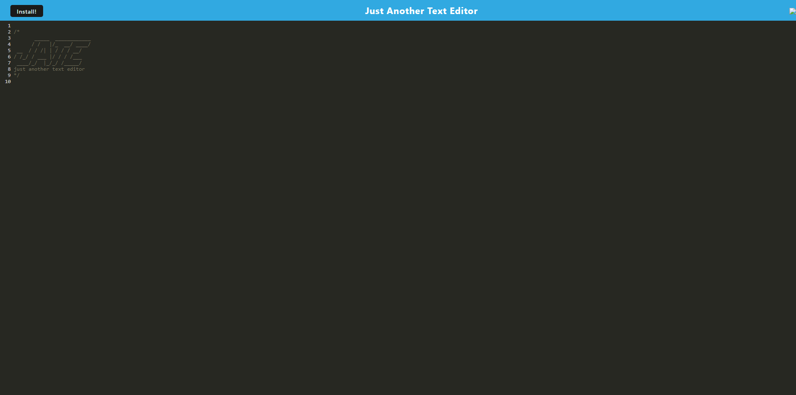
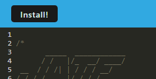

# Text Editor

## Technology Used

| Technology Used |                                                    Resource URL                                                    |
| --------------- | :----------------------------------------------------------------------------------------------------------------: |
| JavaScript      | [https://developer.mozilla.org/en-US/docs/Web/JavaScript](https://developer.mozilla.org/en-US/docs/Web/JavaScript) |
| Nodejs          |                                   [https://nodejs.org/en](https://nodejs.org/en)                                   |
| Webpack         |                                  [https://webpack.js.org](https://webpack.js.org)                                  |

## Description

This is an application that is able to create notes and code snippets. This app can work without an internet connection as long as the user has visited the page.

[link to deployed app](https://stark-garden-66882-cd760d961ca2.herokuapp.com)

## Usage

All you have to do is type and the text is automatically saved.

# Installation

There is button at the top left that says "install!"
once pressed the app will install and launch.

## Learning Points

1. I learned how to make an installable app in this homework.
2. Learned how to build methods to retrieve and add to a database

## Author Info

- [GitHub](https://github.com/Jarell-Chinn)
